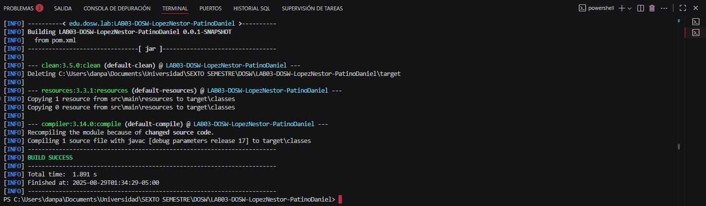

# 🧩 LAB03-DOSW-LopezNestor-PatinoDaniel
# 📘 Laboratorio - CVDS DOSW 01  

## 👥 Integrantes  
- **Daniel Patiño Mejía**  
- **Néstor David López Castañeda**  

---

## 🏷️ Grupo  
**DOSW-01**  

---

## 📂 Evidencias  

**Primera entrega: Maven compilando correctamente con la configuracion solicitada**
- **Imagen:**  
  

  ## 📂 Reto 1

  •	Identifiquen reglas de negocio:

    - Gestiorar cuentas bancarias.
    - Gestionar Servicios financieros basicos.
    

  •	Funcionalidades principales:

    - Crear y validar cuentas de los clientes.
    - Realizar consulta de saldos.
    - Hacer depositos.

  •	Escriban los actores principales.
    - Cliente.
    - Banco.
    - Administrador.

  •	Documenten las precondiciones necesarias para el sistema.
    - La cuenta debe tener exactamente 10 digitos
    - Los dos primeros digitos de la cuenta deben corresponder a un banco registrado
    - El numero de cuenta no debe tener letras ni caracteres especiales.  

