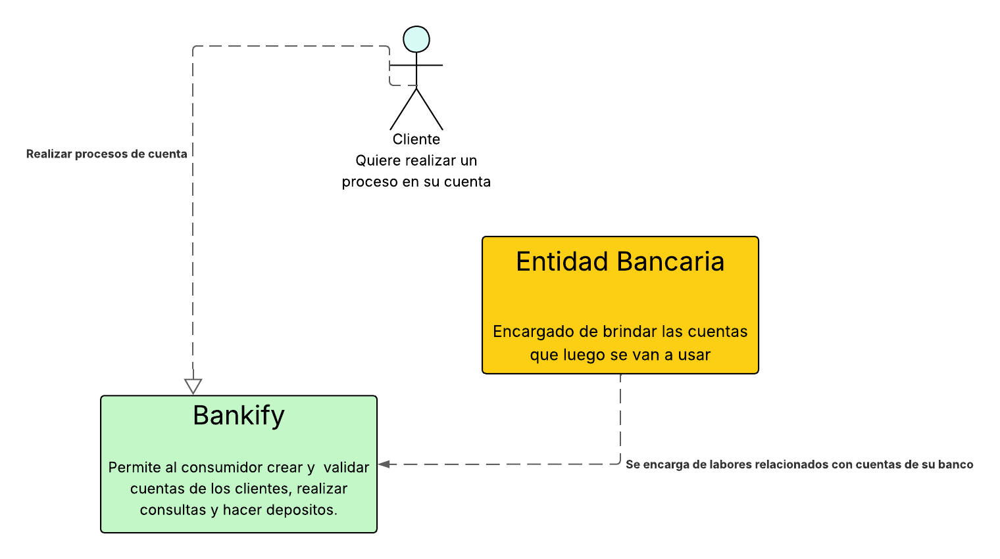

# 🧩 LAB03-DOSW-LopezNestor-PatinoDaniel
# 📘 Laboratorio - CVDS DOSW 01  

## 👥 Integrantes  
- **Daniel Patiño Mejía**  
- **Néstor David López Castañeda**  

---

## 🏷️ Grupo  
**DOSW-01**  

---

## 📂 Evidencias  

**Primera entrega: Maven compilando correctamente con la configuracion solicitada**
- **Imagen:**  
  

  ## 📂 Reto 1

  •	Identifiquen reglas de negocio:

    - Gestiorar cuentas bancarias.
    - Gestionar Servicios financieros basicos.
    

  •	Funcionalidades principales:

    - Crear y validar cuentas de los clientes.
    - Realizar consulta de saldos.
    - Hacer depositos.

  •	Escriban los actores principales.
    - Cliente.
    - Banco.
    - Administrador.

  •	Documenten las precondiciones necesarias para el sistema.
    - La cuenta debe tener exactamente 10 digitos
    - Los dos primeros digitos de la cuenta deben corresponder a un banco registrado
    - El numero de cuenta no debe tener letras ni caracteres especiales.  
 
 ## 📂 Reto 2

Para el reto 2 tuvimos que realizar la **diagramación** basándonos en el **Reto 1**.

---

### 🟢 1. Diagrama de Contexto
Primero, creamos el **diagrama de contexto**, el cual resume el punto 1 de forma general y muestra cómo interactúan las entidades principales.

Al momento de crearlo, teníamos **dos opciones**:
- Separar cada banco como entidades independientes.
- Mantenerlos como **una sola entidad bancaria**.

Finalmente, decidimos dejarlos como **una sola entidad**, ya que así será más sencillo, en un futuro, permitir la **expansión hacia otros bancos**.

---

### 🟢 2. Diagrama de Casos de Uso
Después, realizamos el **diagrama de casos de uso**. Aquí tuvimos un problema:  
no sabíamos si incluir a los **bancos** como agentes o no.  
Al final, decidimos **no incluirlos** y dejar únicamente a los **clientes**, planteando sus respectivas necesidades.

---

### 🟢 3. Descripción de Casos de Uso
Además, debíamos crear un **Excel** donde describimos cada caso de uso, detallando su **tipo**.

---

### 🟢 4. Diagrama de Clases
Finalmente, elaboramos el **diagrama de clases**, donde mostramos cómo creemos que será la estructura más adecuada para implementar la solución de **Bankify**.  
Aquí plasmamos cómo imaginamos que se organizará el código para que sea **más claro, simple y eficiente**.

.png)

## **🃏 Reto 3 – Planning Poker**
En este reto, desarrollamos una **aplicación en consola** que simula una sesión de **Planning Poker**.  
Para organizar el proyecto, definimos las siguientes clases:

### **📌 Estructura de Clases**
1. **Clase `Fibonacci`**  
   - Contiene la **serie de Fibonacci**.  
   - Permite verificar si un número pertenece a la serie.

2. **Clase `Tareas`**  
   - Almacena el **nombre** y la **descripción** de cada tarea.

3. **Clase `Votos`**  
   - Maneja los **votos del equipo** y verifica si todos coinciden.

4. **Clase `PlanningPoker`**  
   - Clase auxiliar que **coordina la lógica** principal y organiza la interacción entre las demás clases.

5. **Clase `Main`**  
   - Ejecuta la aplicación y resuelve el problema utilizando las otras clases.

### **🎯 Resultado de la Aplicación**

##Reto 4

## Reto 5
## Contexto

En un primer momento agregamos lo necesario al pom y verificamos que nos funcionara. Tras esto probamos cuando cubria nuestras pruebas, ahi logramos evidenciar que eran pobres ya que solo cubrian el 17% del codigo. Esto nos preocupo bastante y nos dio a entender que nuestras pruebas eran muy precarias por lo que tuvimos que agregar mas. Asi logramos que estas cubrieran el 80% de nuestro codigo mostrando que es un codigo optimo y que las pruebas lo cubren casi en su totalidad.

## Cobertura Inicial

## Cobertura Mejorada

